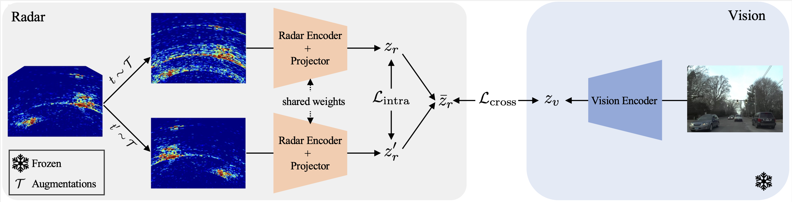

# [CVPR 2024] Radical: Bootstrapping Autonomous Driving Radars with Self-Supervised Learning

This is the official repository for the CVPR 2024 paper "Bootstrapping Autonomous Driving Radars with Self-Supervised Learning". [[arxiv]](https://arxiv.org/pdf/2312.04519)

## Method Overview



## Pre-trained Models

The pre-trained backbones will be released soon.

## Setting up the environment
Download repository
```
git clone https://github.com/yiduohao/Radical.git
cd Radical
```

Install detectron2 package
```
python -m pip install -e .
```

## Radical Pre-train
Install the Radatron package
```
cd projects/radical
pip install -e .
```
Run Pre-training Scripts
```
bash train.sh
```

## Radatron Fine-tune
Install the Radatron package
```
cd projects/radatron
pip install -e .
```

Run Fine-tuning Scripts
```
bash train.sh
```

# Citing Radical

```BibTeX
@InProceedings{Hao_2024_CVPR,
    author    = {Hao, Yiduo and Madani, Sohrab and Guan, Junfeng and Alloulah, Mohammed and Gupta, Saurabh and Hassanieh, Haitham},
    title     = {Bootstrapping Autonomous Driving Radars with Self-Supervised Learning},
    booktitle = {Proceedings of the IEEE/CVF Conference on Computer Vision and Pattern Recognition (CVPR)},
    month     = {June},
    year      = {2024},
    pages     = {15012-15023}
}
```
